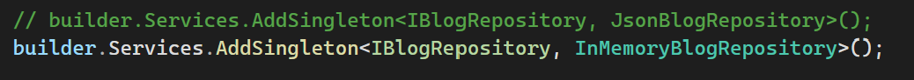
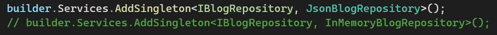
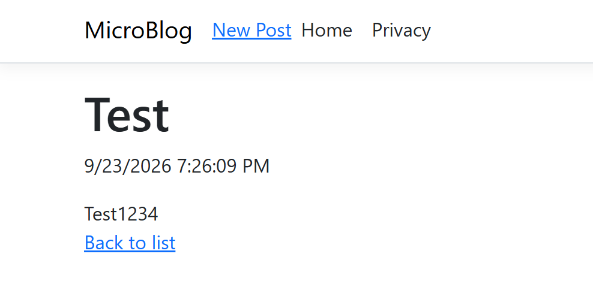
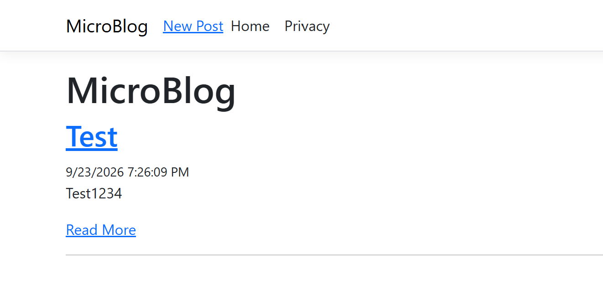
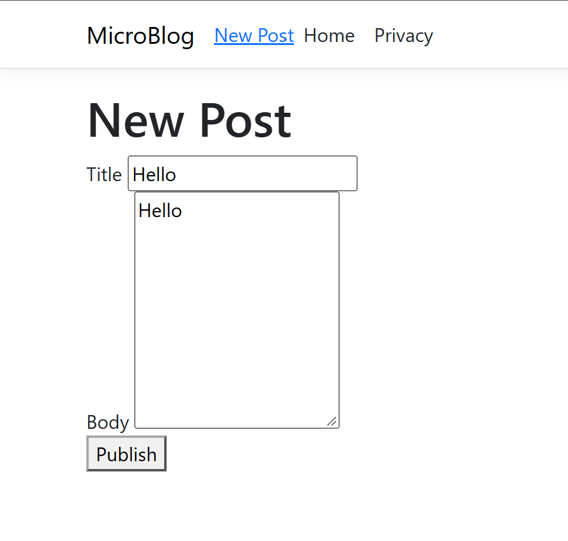

# MicroBlog

MicroBlog is a small RAZOR web app that allows users to create blog posts, and view them later. With the newest update, users also have the choice between in-memory and JSON storage for their blog posts, this way if the user wants a non-saved session all they have to do is type two characters into the Program.cs

# Changing Repositories

Using the in-memory repository.

Using the JSON repository.

# Images

